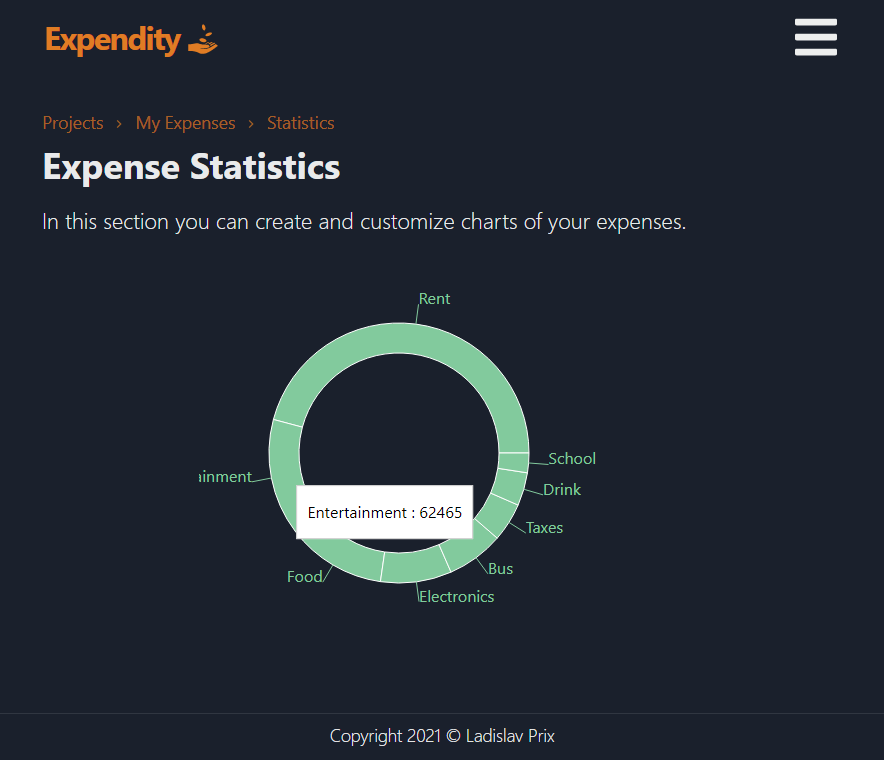
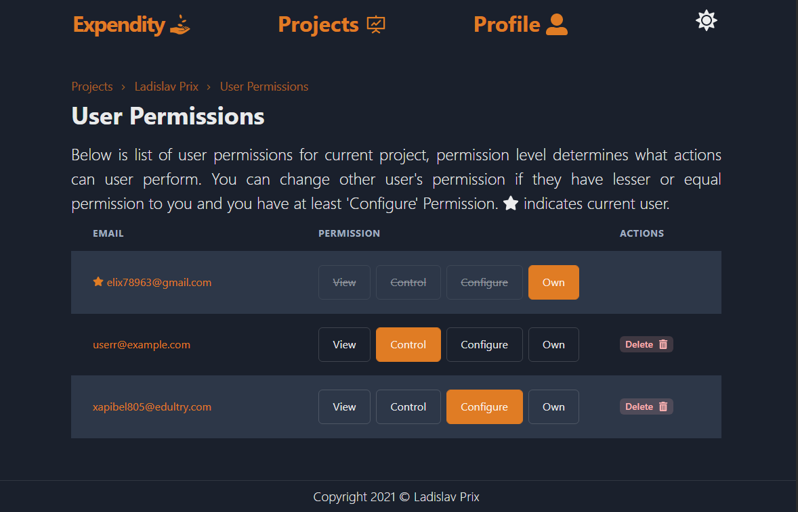
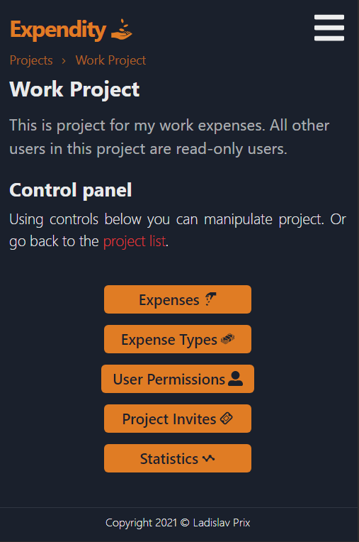

# Expendity

Expense tracking application with user permissions, invites and statistics.

## Application Parts

The frontend can be found in [Expendity React](https://github.com/prixladi/expendity-react) repository. 
The backend can be found in [Expendity Server](https://github.com/prixladi/expendity-server) repository. 
Application is using [Shamyr Authority](https://github.com/prixladi/shamyr-cloud-authority) as an identity provider.

## Data

Folder [/data](data) contains default email templates. File [/Data.md](Data.md) contains JSON data that can be used to initialize Database (Client and email templates).

## Docker

### `docker-compose up`

Runs production-ready containers with the configuration specified in [/docker-compose.yml](docker-compose.yml).

## Images from app

