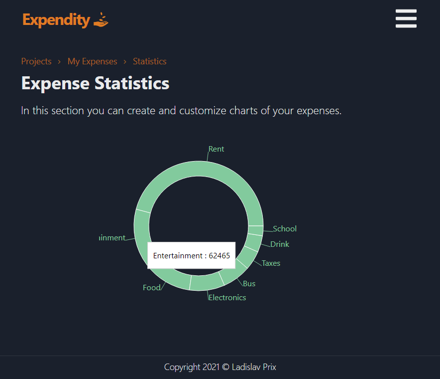
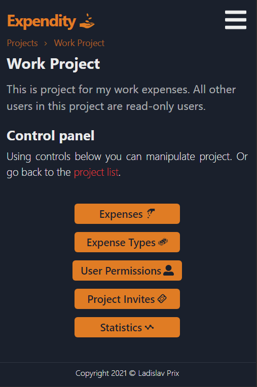

# Expendity

Expense tracking application with user permissions, invites and statistics.

## Applications

- [Frontend](/apps/web) - react web application and administration communicating with backend
- [Backend](/apps/server) - .NET backend server storing data to postgresql

## External

- [Authority](https://github.com/prixladi/shamyr-cloud-authority) - identity provider
- [PostgreSQL](https://www.postgresql.org/) - main database

## Application images

